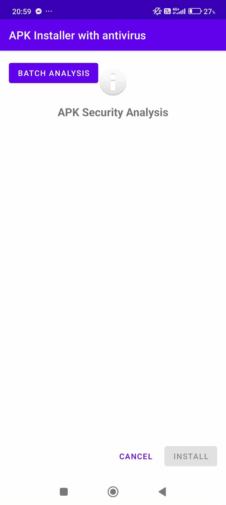

# APK Installer with Antivirus

## 📱 Project Overview
APK Installer with Antivirus is an Android application that provides secure APK installation with built-in malware detection capabilities. The app analyzes APK files for potentially dangerous permissions and suspicious code patterns before allowing installation.

## ✨ Features
- **Security Analysis**: Scans APK files for dangerous permissions and suspicious API usage
- **AI-Powered Detection**: Uses Gemini AI API to perform intelligent risk assessment
- **Safe Installation**: Warns users about potentially harmful applications
- **Batch Analysis**: Supports analyzing multiple APK files for research purposes
- **Dataset Evaluation**: Generates accuracy metrics for malware detection

## 📸 Screenshots

## 🛠️ Setup Instructions

### Prerequisites
- Android Studio Hedgehog (2023.1.1) or newer
- Kotlin 1.9.0+
- Java 8
- Gemini API key

### Configuration
1. Clone the repository
2. Add your Gemini API key to `gradle.properties`:
GEMINI_API_KEY=your_api_key_here

3. Open the project in Android Studio and sync Gradle

4. Build and run the application on your device or emulator

## 📱 Usage

### Single APK Analysis
1. Open the app directly or select an APK file from a file manager
2. The app will automatically analyze the APK for security risks
3. Review the analysis results including:
- Basic security analysis of permissions and code
- AI-powered risk assessment
4. Choose to install or cancel based on the analysis

### Batch Analysis
1. Tap the "Batch Analysis" button on the main screen
2. Specify input dataset path (default: `/sdcard/apk_dataset/`)
3. Set output directory for results
4. Start analysis to evaluate multiple APKs
5. View comprehensive metrics and reports

## 📂 Dataset Structure

/sdcard/apk_dataset/

├── safe/               # APK files verified as safe
│   ├── app1.apk
│   ├── app2.apk
│   └── ... (clean applications)

├── malware/            # APK files identified as malicious
│   ├── malware1.apk
│   ├── malware2.apk
│   └── ... (malicious applications)

└── suspicious/         # APK files with suspicious behavior (optional)
 ├── suspicious1.apk
 └── ... (potentially harmful applications)

## 🔍 Dataset Description

This dataset consists of Android APK files organized into categories based on their security classification:

* **Safe**: Applications that have been verified as safe and contain no malicious code
* **Malware**: Applications that contain malicious code, trojans, spyware, or other harmful functionality
* **Suspicious**: Applications that exhibit some potentially harmful behavior but are not conclusively malicious

## 📊 Analysis Results

The batch analysis generates several output files:
- CSV files with analysis results
- Confusion matrix visualization
- Precision, recall, and F1 score metrics
- List of misclassified samples

## 📚 Libraries Used
- dexlib2: For APK parsing and analysis
- Material Components: For modern UI elements
- Coroutines: For asynchronous operations
- Gemini API: For AI-powered malware detection

## 🔐 Permissions Required
- READ_EXTERNAL_STORAGE / READ_MEDIA_* (Android 13+)
- MANAGE_EXTERNAL_STORAGE (for batch analysis)
- REQUEST_INSTALL_PACKAGES
- INTERNET

## ⚠️ Important Notes
- This app is for research and educational purposes
- Always verify apps from unknown sources carefully
- The AI analysis provides recommendations but is not 100% accurate

